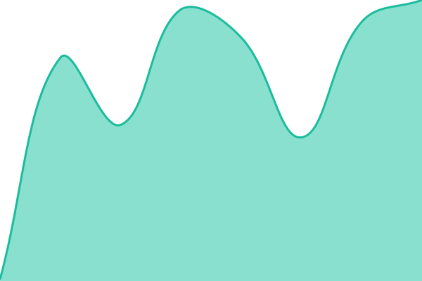
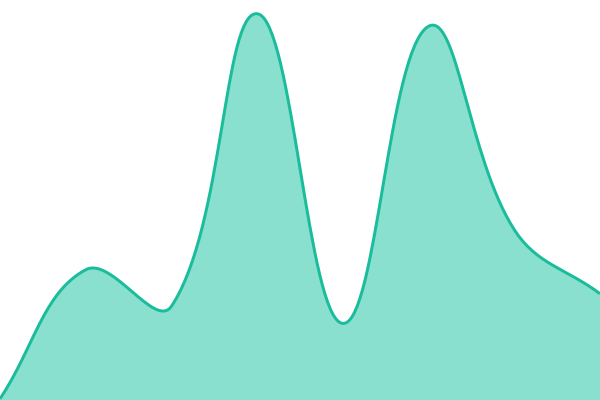
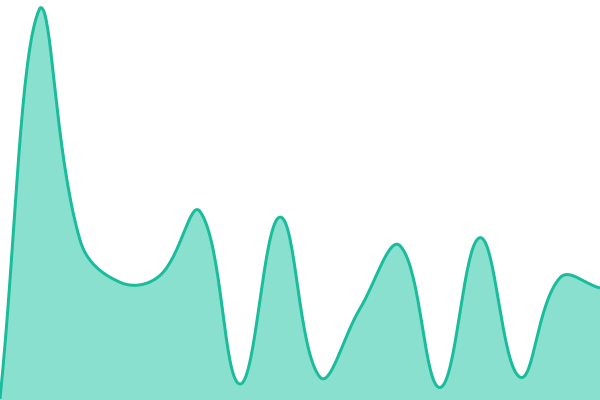
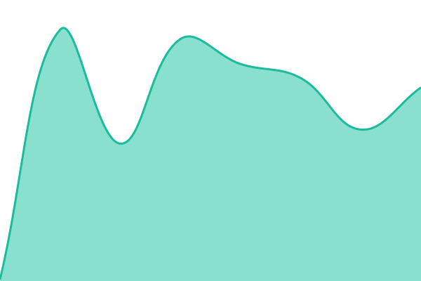

# [📈 Live Status](https://axiom-browser-automation.github.io/status): <!--live status--> **🟩 All systems operational**

This repository contains the open-source uptime monitor and status page for [axiom.ai](https://axiom.ai), powered by [Upptime](https://github.com/upptime/upptime).

With [Upptime](https://upptime.js.org), you can get your own unlimited and free uptime monitor and status page, powered entirely by a GitHub repository. We use [Issues](https://github.com/axiom-browser-automation/status/issues) as incident reports, [Actions](https://github.com/axiom-browser-automation/status/actions) as uptime monitors, and [Pages](https://axiom-browser-automation.github.io/status) for the status page.

<!--start: status pages-->
<!-- This summary is generated by Upptime (https://github.com/upptime/upptime) -->
<!-- Do not edit this manually, your changes will be overwritten -->
<!-- prettier-ignore -->
| URL | Status | History | Response Time | Uptime |
| --- | ------ | ------- | ------------- | ------ |
|  [Website](https://raw.githubusercontent.com/axiom-browser-automation/status/HEAD/status/website.json) | 🟩 Up | [website.yml](https://github.com/axiom-browser-automation/status/commits/HEAD/history/website.yml) | 

 106ms
     
 | 

<a href="https://axiom-browser-automation.github.io/status/history/website">100.00%</a>
    

|  [Cloud](https://raw.githubusercontent.com/axiom-browser-automation/status/HEAD/status/cloud.json) | 🟩 Up | [cloud.yml](https://github.com/axiom-browser-automation/status/commits/HEAD/history/cloud.yml) | 

 88ms
     
 | 

<a href="https://axiom-browser-automation.github.io/status/history/cloud">100.00%</a>
    

|  [CDP](https://raw.githubusercontent.com/axiom-browser-automation/status/HEAD/status/cdp.json) | 🟩 Up | [cdp.yml](https://github.com/axiom-browser-automation/status/commits/HEAD/history/cdp.yml) | 

 77ms
     
 | 

<a href="https://axiom-browser-automation.github.io/status/history/cdp">100.00%</a>
    

|  [Extension](https://raw.githubusercontent.com/axiom-browser-automation/status/HEAD/status/extension.json) | 🟩 Up | [extension.yml](https://github.com/axiom-browser-automation/status/commits/HEAD/history/extension.yml) | 

 102ms
     
 | 

<a href="https://axiom-browser-automation.github.io/status/history/extension">100.00%</a>
    

|  [Scheduler](https://raw.githubusercontent.com/axiom-browser-automation/status/HEAD/status/scheduler.json) | 🟩 Up | [scheduler.yml](https://github.com/axiom-browser-automation/status/commits/HEAD/history/scheduler.yml) | 

 77ms
     
 | 

<a href="https://axiom-browser-automation.github.io/status/history/scheduler">100.00%</a>
    

<!--end: status pages-->

[**Visit our status website →**](https://axiom-browser-automation.github.io/status)

## 📄 License

- Powered by: [Upptime](https://github.com/upptime/upptime)
- Code: [MIT](./LICENSE) © [Anand Chowdhary](https://anandchowdhary.com)
- Data in the `./history` directory: [Open Database License](https://opendatacommons.org/licenses/odbl/1-0/)
